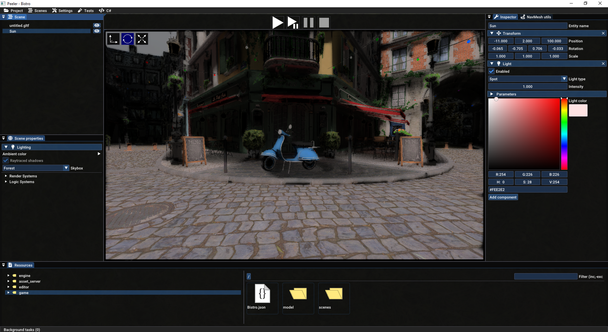

# Carrot

Game engine in C++, mostly for my own fun.

Don't expect support for the moment.

Compiled with Visual Studio 2022.

## Structure
* `core`: Core code. Basic functions such as IO, logging. Also serves as de-duplication of code between offline tools and the engine code.
* `engine`: Engine code
  * `engine/engine`: Engine implementation
  * `engine/resources`: Resources used by the engine (or left over from old code).
  * `engine/tools`: Particle editor code. Should move to `editor/` at some point.
* `asset_tools`: Tools used to prepare assets.
* `editor`: Peeler editor code and resources.
* `samples`: Directories of different samples for Carrot.

## Dependencies

### What you need to install
* `Vulkan`: Graphics API. I currently use the 1.3.246.0 LunarG SDK.
* `Lua`: LuaJIT and Vanilla Lua are both supported by sol3 (C++ lib for Lua support).
* `Mono`: Carrot engine uses Mono to run C# code. Using mono-6.12.0.182 at the time of writing

### Thirdparty libraries
* `Vulkan`: Graphics API. I currently use the 1.3.246.0 LunarG SDK.
* `asio`: Networking lib.
* `Assimp`: **ass**et **imp**orting lib, used to load models
* `dr_libs`: Audio codecs
* `GLFW`: Cross-platform window & input API.
* `GLM`: Math lib
* `Dear ImGui`: Immediate mode GUI
* `imgui-node-editor`: 
* `sol3`: Lua <-> C++ support
* `OpenXR`: XR (AR+VR) API.
* `rapidjson`: Json support
* `stduuid`: Cross-platform UUID lib.
* `Tracy`: Profiler.
* `stb_image`, `stb_image_write`, `stb_truetype`, `stb_vorbis`. Various single-file headers
* `ImGuizmo`: Guizmo lib for Dear ImGui. Used by the Peeler editor.
* `Mono`: C# runtime

## Some of its features
- Vulkan renderer
- Raytraced lighting & shadows
- Skeletal animation support
- Entity Component System
- Networking
- Lua scripting
- (partial) VR support
- Basic audio support

## Screenshot of editor

# Building
VR requires building manually thirdparty/OpenXR-SDK-Source

Use `XR_API_LAYER_PATH=<path to Carrot>\thirdparty\OpenXR-SDK-Source\build\win64\src\api_layers` as an environnement variable to enable api layers. Change win64 by your platform if necessary.

## Assimp
Assimp broke FBX animation timing "recently", so the Assimp dependency is my fork, with the <b8bf1eac041f0bbb406019a28f310509dad51b86> commit reverted.

# Credits
* Splash screen & logo by *Benjamin "beb" Er-Raach*